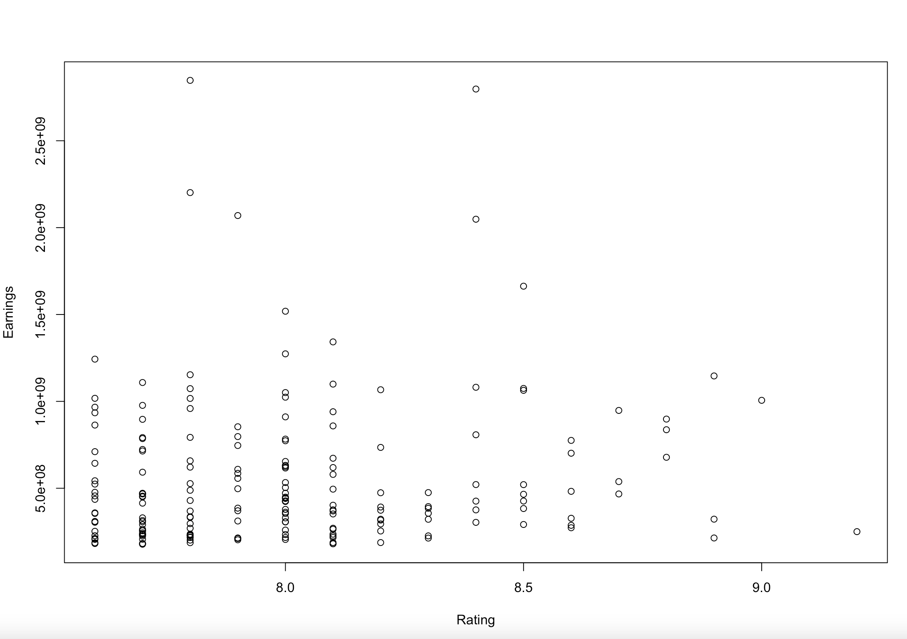
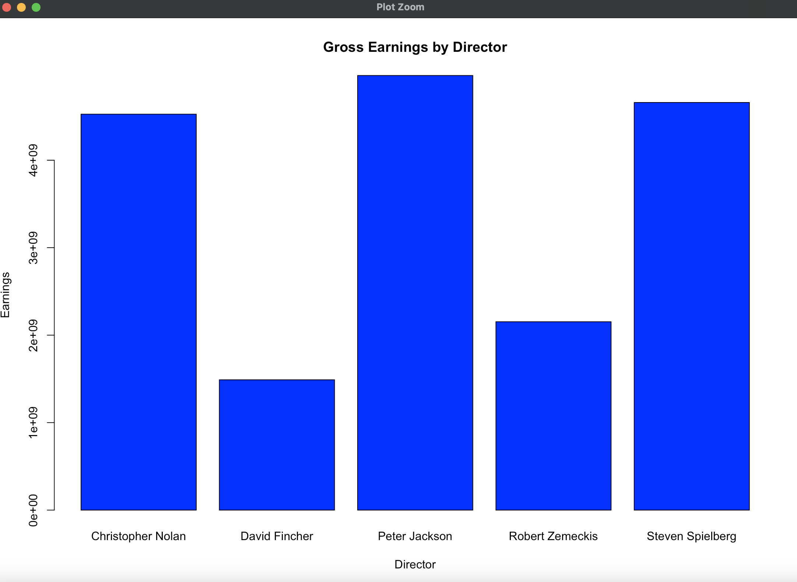
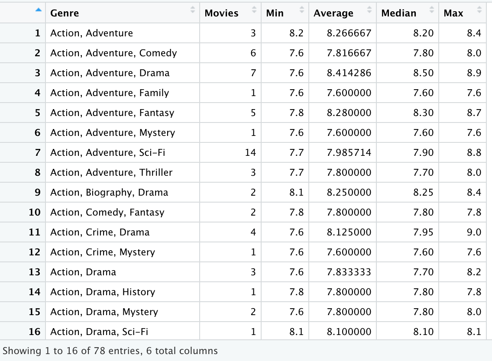

# Data Wrangling Project
> The purpose of this project was to display my skills I developed here at Tippie in R-Studio. My group and I wanted to analyze how Movie ratings correlated with earnings overtime. Throughout this project we look at multiple different aspects that dive into that relationship. 

Our group wanted to analyze how ratings and earnings are correlated for movies. We wanted to showcase the skills we developed in R Studio at the Unversity of Iowa - Tippie College of Business.

## Table of Contents
* [Info](#information)
* [Questions](#questions-to-answer)
* [Resources and Tools](#resources-and-tools)
* [Features](#features)
* [Setup](#setup)
* [Project Status](#project-status)
* [Acknowledgements](#acknowledgements)
* [Contact](#contact)

## Information
- This final project was the final assignment of the Data Wrangling course at the University of Iowa
- Data was gathered from Kaggle and Box Office Mojo

## Questions to Answer
- What is the distribution of movies and ratings across different genres? 
- Is there any relationship between IMDb ratings and worldwide gross earnings?
- Is there a relationship between the Director’s that have produced multiple films and the gross earnings for their films? 

## Resources and Tools
- RStudio
- Github Desktop
- Microsoft Excel

## Features
- Ratings vs Earnings Correlation

- Top 5 Earning Directors Bar Chart

- Merged Dataset with Earnings and Ratings

## Setup
To correctly run this project one should have the latest version of RStudio downloaded. Once complete, download the 'Final Project.R' script and the 'imdb_top_1000.csv' to your local desktop. Set the working directory to your desktop in RStudio and begin running the code within the R script. 

## Project Status
Project is: _complete_

## Acknowledgements
- My group members Caleb Kitzman, Blake Murray, Grant Truesdale, and Asher Titus collaborated on this project together.
- This project was inspired by Professor Mike Colbert in his Data Wrangling course at the University of Iowa. 
- Data from this project was scraped from [Box Office Mojo](https://www.boxofficemojo.com/chart/ww_top_lifetime_gross/?ref_=bo_lnav_hm_shrt) and downloaded from [Kaggle](https://www.kaggle.com/harshitshankhdhar/imdb-dataset-of-top-1000-movies-and-tv-shows).

## Contact
Created by [@BlakeJohnson](https://www.linkedin.com/in/blake-johnson-545b72184/) - feel free to connect with me!
